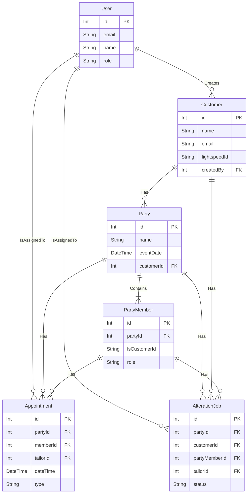

# SuitSync Database Documentation

> **Note:** For the latest project architecture, Docker usage, and environment variable documentation, see the main [README.md](./README.md) and the docs directory.

# SuitSync Database Schema

This document provides a visual overview of the core database models and their relationships in the SuitSync application, as defined in `prisma/schema.prisma`.

## Entity-Relationship Diagram (ERD)

The following diagram illustrates the primary entities and how they connect to one another.

## Core Models

- **User**: Represents a staff member who can log in to the application. Can be an admin, associate, or tailor.
- **Customer**: A customer record, synced from Lightspeed. A customer can be the primary contact for multiple parties.
- **Party**: A group of customers for a specific event (e.g., a wedding party). Each party is linked to a primary customer contact.
- **PartyMember**: An individual member of a party. This model links a party to one or more Lightspeed customers.
- **Appointment**: Represents a scheduled event, such as a fitting or pickup. It is linked to a party and can be assigned to a specific party member and tailor.
- **AlterationJob**: A specific alteration task for an item. It can be linked to a party, a customer, or a specific party member, and is assigned to a tailor.

For the complete schema including all fields, data types, and relations, please refer to the `prisma/schema.prisma` file. 