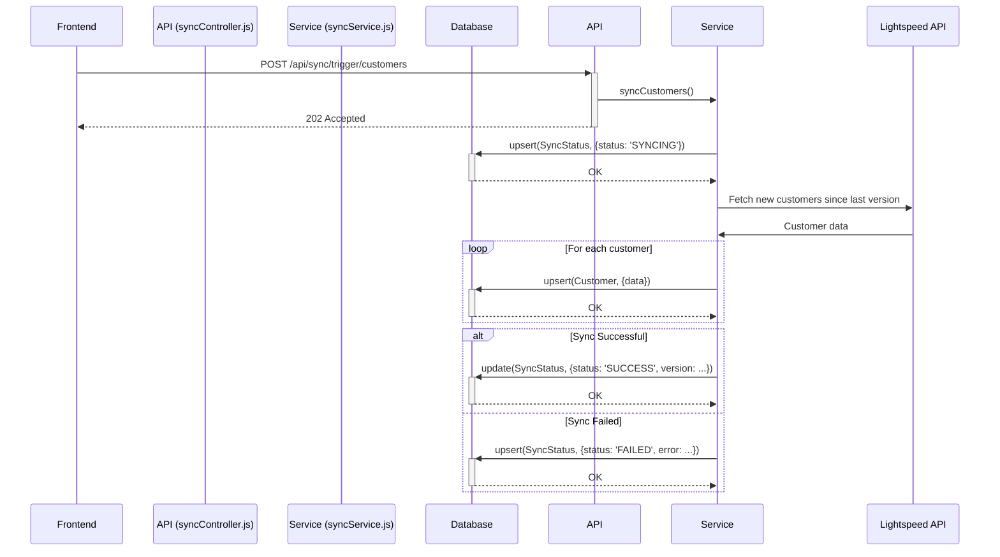

# SuitSync Synchronization Service Architecture

This document outlines the architecture and core principles of the data synchronization service that keeps the local SuitSync database in sync with the Lightspeed X-Series API. Adhering to these principles is critical for maintaining the stability and resilience of the system.

## 1. Overview

The synchronization service is responsible for fetching resources (like Customers and Products) from the Lightspeed API and upserting them into the local PostgreSQL database. It is designed to be a robust, self-contained background process that can be triggered manually by an administrator or on a recurring schedule.

The key challenge is ensuring the service is resilient to failure, provides immediate feedback to the user, and never crashes the server, even when external APIs or the database are temporarily unavailable.

## 2. Core Architectural Principles

The stability of the sync service relies on the following principles:

### a. Self-Contained Status Management

The `syncService.js` is **fully responsible for its own status**. The API controller that triggers a sync (`syncController.js`) is "fire-and-forget." It only initiates the process and should **never** interact with the `SyncStatus` table in the database.

- **On Start**: The `syncResource` function must immediately `upsert` the resource's status to `SYNCING`. This provides instant feedback in the UI.
- **On Completion**: It must `update` the status to `SUCCESS`, storing the latest version number from Lightspeed.
- **On Failure**: It must `upsert` the status to `FAILED` and record the error message.

### b. Resilience Through `upsert`

The service must not crash if it fails at an unexpected time. The primary tool for this is `prisma.syncStatus.upsert()`.

- **In the `try` block**: The initial status update uses `upsert`. This handles the case of a resource syncing for the first time.
- **In the `catch` block**: The failure status update **must also use `upsert`**. This is critical. If the service fails *before* the initial `SYNCING` status is created (e.g., due to an API client authentication error), a simple `update` call would fail because there is no record to update, crashing the entire server process. `upsert` safely creates the failure record if it doesn't exist.

### c. System-Level Authentication for Background Jobs

All background syncs, whether scheduled or manually triggered, run as a system-level process. They **must not** depend on a user's session.

The `createLightspeedClient(null)` function is always used within the `syncService` to ensure it uses the application's persistent, system-wide OAuth token.

### d. Defensive Serialization in Controllers

Server crashes can occur if complex data types are passed directly to `res.json()`. To prevent this, any controller that fetches data from the database (especially from the `SyncStatus` table) must manually serialize potentially problematic data types before sending the response.

- `BigInt` -> `string`
- `DateTime` -> `string` (using `.toISOString()`)

This creates a defensive barrier and guarantees that no serialization error can take down the server.

## 3. Component Breakdown

-   `server/services/syncService.js`: The heart of the service. Contains the generic `syncResource` function, which implements the core logic described above. It also contains resource-specific mappers (e.g., `customerMapper`) and trigger functions (e.g., `syncCustomers`).
-   `server/controllers/syncController.js`: The API layer. Exposes endpoints like `/api/sync/trigger/:resource`. Its only job is to authenticate the request and call the relevant function in `syncService.js`.
-   `server/routes/sync.js`: Defines the API routes and applies necessary middleware (e.g., `authMiddleware`, `requireAdmin`).
-   `prisma/schema.prisma`: Defines the `SyncStatus` model, which is the source of truth for the state of all syncable resources.

## 4. Process Flow: Manual Customer Sync

This diagram illustrates the full, end-to-end flow of a manually triggered customer sync.

## 5. Adding New Syncable Resources

Adding a new resource (e.g., "Invoices") is straightforward:

1.  **Add a Mapper**: Create a `invoiceMapper` function in `syncService.js` to transform the Lightspeed invoice object into your Prisma `Invoice` schema.
2.  **Add a Trigger Function**: Create a `syncInvoices` function that calls the generic `syncResource` with the new details: `const syncInvoices = () => syncResource('invoices', '/invoices', prisma.invoice, invoiceMapper);`
3.  **Update the Controller**: Add `'invoices': syncInvoices` to the `syncFunctions` object in `syncController.js`.

The core `syncResource` function handles all the logic for status updates, error handling, and pagination. 